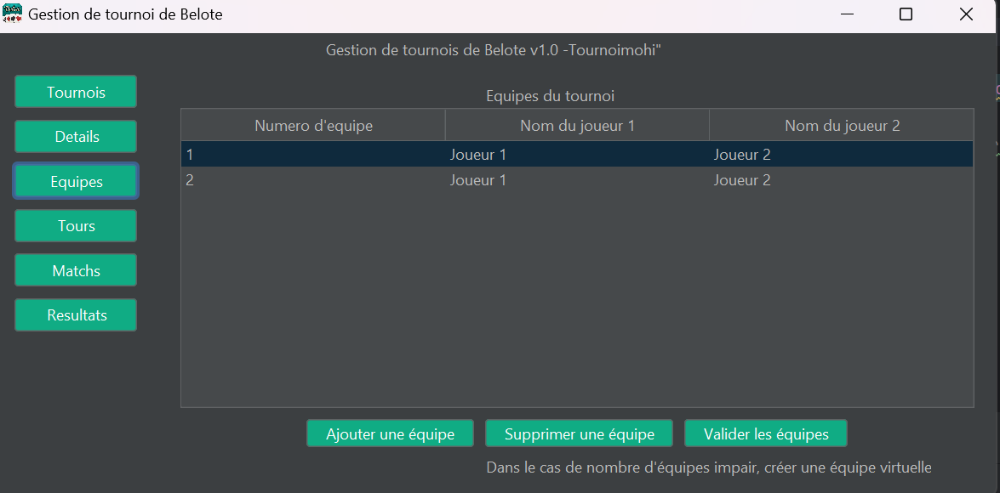

# Project Refactoring Documentation
### Overview

In this iteration, our project underwent significant refactoring to improve design, maintainability, security, and efficiency. Below is a detailed account of each refactoring step, including the rationale behind it and example code snippets from the project.


### NOTE

Note that when creating an even number of teams, and clicking on "Valider Equipes" in order to create a "Tour", the Tour is successfully created, however, a small latency prevents it from appearing right away in the "Matchs" Panel, i.e the function responsible for creating a "Tour" works **perfectly!**. If matches do not appear, just click again. 

### Refactoring Details

## 1. DAO ***Design Pattern*** Implementation

> Implemented the Data Access Object (DAO) ***Design Pattern*** with corresponding interfaces and abstract classes for each entity.

**Benefits**

Ensures a separation of the data persistence logic from the business logic, leading to more modular, understandable, and maintainable code.

For instance, the <strong><code>EquipeDAO.java</code></strong> class implements the methods of the Interface <strong><code>EquipeIDAO.java</code></strong> interface:

 ```java 
// EquipeDAO.java
public class EquipeDAO extends AbstractDAO implements EquipeIDAO {

    @Override
    public void add(Equipe obj) {
        // Method implementation for adding an Equipe
    }

    // ... other methods of the interface implemented
}
```

## 2. Factory Design Pattern for Object Creation
Adopted the Factory Design Pattern to centralize the creation of objects. Note that the Singleton Design Pattern was also used inside the Factory in order to ensure that we only create a unique DAO per class.

 ```java 
// FactoryDAO.java
public final class FactoryDAO extends AbstractDAO {

    private FactoryDAO() {
        //prevent instantiation
    }

    public static MatchDAO getMatchDAO() {
        return MatchDAOHolder.INSTANCE;
    }

    public static EquipeDAO getEquipeDAO() {
        return EquipeDAOHolder.INSTANCE;
    }

    public static TournoiDAO getTournoiDAO() {
        return TournoiDAOHolder.INSTANCE;
    }

    private static class MatchDAOHolder {
        private static final MatchDAO INSTANCE = new MatchDAO();
    }

    private static class EquipeDAOHolder {
        private static final EquipeDAO INSTANCE = new EquipeDAO();
    }

    private static class TournoiDAOHolder {
        private static final TournoiDAO INSTANCE = new TournoiDAO();
    }

}
```

## 3. Composite Design Pattern for Hierarchical Structures
Implemented the Composite Design Pattern to manage hierarchical structures in the application. Since we have a hierarchical structure:

- Tournoi has Matches
- Matches has Equipes
- Equipes has Joueur

Every class that is implemented within this structure holds a List of its Components.

## 4. Encapsulation through Getters and Setters

-  Created getters and setters for all attributes in each class to encapsulate the properties.

-  Refactored the code to use getters and setters instead of directly accessing class attributes.

** Benefits**

- Promotes better control over the access and modification of class attributes, enhancing security and flexibility.

- Enhances encapsulation and allows for additional logic to be incorporated when accessing or modifying attributes.

**Example code:**
```java
// In Equipe.java
public class Equipe {
    private int numEquipe;

    public int getNumEquipe() {
        return numEquipe;
    }

    public void setNumEquipe(int numEquipe) {
        this.numEquipe = numEquipe;
    }
    // Other getters and setters
}

// In EquipeDAO.java
// Using setters and getters in DAOs
equipe.setNumEquipe(rs.getInt("num_equipe"));

```

## 5. Enhanced Application UI

> Revamped the logo and the user interface for improved usability and aesthetics.




## 6. Sanitized Queries with Prepared Statements

- Replaced all traditional string concatenation SQL queries with sanitized prepared statements.

**Benefits**

> Significantly improves security by preventing SQL injection and improves performance with precompiled SQL in the database.

All queries to the database are secured through a prepared statement:

```java
// In EquipeDAO.java for adding an equipe
String stmt = "INSERT INTO equipes(num_equipe, ...) VALUES (?, ...)";
PreparedStatement pst = connection.prepareStatement(stmt);
pst.setInt(1, obj.getNumEquipe());
// ... set other parameters
pst.executeUpdate();
```

## 7. Lazy Instantiation Using Proxy Design Pattern

Implemented the Proxy Design Pattern for lazy instantiation of database connection objects.

 
**Benefits**

> Improves performance by delaying database connection creation until necessary and ensures efficient resource usage.

**Code snippet**
```java
// In SingleConnection.java
public static Connection getConnection() {
    if (connection == null) {
        connection = DriverManager.getConnection(...);
    }
    return connection;
}
```

## 8. Implement Singleton Pattern in SingleConnection Object

> Implemented the Singleton ***Design Pattern*** in the SingleConnection class to ensure only one instance of the connection is used throughout the application.

**Benefits**

Maintains a single database connection instance throughout the application's lifecycle, reducing overhead and preventing multiple connections.

**Example code**

```java
// In SingleConnection.java
public class SingleConnection {
    private static SingleConnection instance;
    
    private SingleConnection() {
        // private constructor
    }

    public static SingleConnection getInstance() {
        if (instance == null) {
            instance = new SingleConnection();
        }
        return instance;
    }
}
```

## 9.properties Files for Language Support and Configuration

> Utilized .properties files for managing language resources and application configuration, enhancing internationalization and configuration management.

## 10. Maven for Build Automation and Dependency Management

> Integrated Maven to manage project builds and dependencies.

**Example Maven Configuration:**

```xml
<dependency>
    <groupId>org.springframework</groupId>
    <artifactId>spring-context</artifactId>
    <version>5.2.3.RELEASE</version>
</dependency>
```
## 11. MVC Design Pattern 

> Implemented the MVC Design Pattern to manage models, views, and controllers.


## 12. Use of belote.properties File for Enhanced Cleanliness and Configuration

>  This approach allows for cleaner code and easier management of variables that change frequently or vary between environments, such as database credentials in our case.

**Benefits**

1. ***Separation of Concerns:*** Keeps configuration separate from code logic, making the system easier to understand and manage. 

2. ***Environment Adaptability:*** Easily change settings between development, staging, and production environments without changing the codebase.

3. ***Security:*** Sensitive information like database passwords can be kept out of the code.

4. ***Maintenance:*** Non-developers (e.g., system administrators) can change configuration settings without needing to understand or access the code.

**Example Use**
```properties
#HSQL Database Engine 2.2.8
#Sun Jul 22 19:36:04 CEST 2012
version=2.2.8
modified=yes
db=db
user=user
pwd=pwd
url=url
```

## Conclusion

The recent refactoring has significantly enhanced the project's architecture and code quality. By adopting advanced design patterns, improving encapsulation, ensuring secure and efficient database interactions, and modernizing the application's user interface and build process, the project is now more robust, secure, maintainable, and user-friendly. These improvements form a solid foundation for future developments and enhancements.


